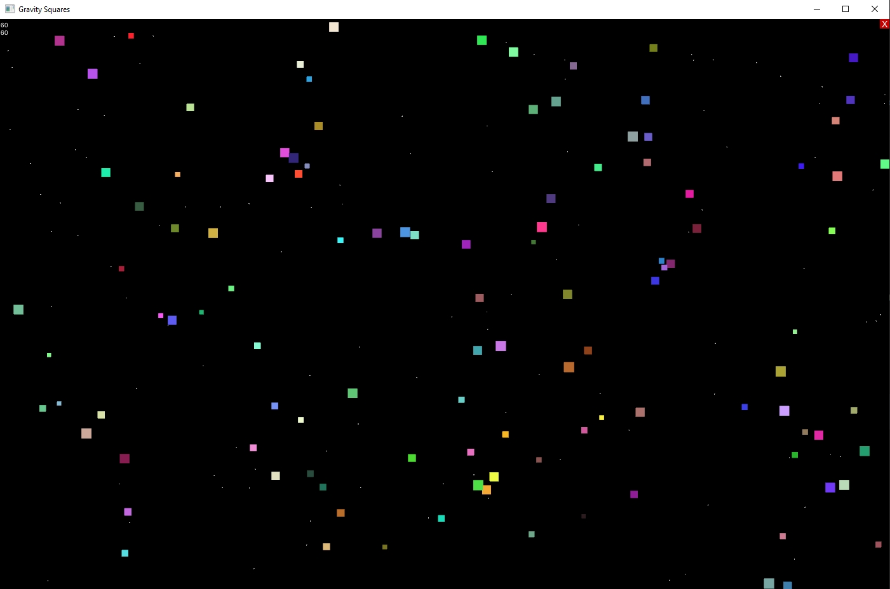

# GravitySquares
Gravity Squares is a simple applet gravity simulator for a bunch of little, random squares

This app is built using GlowUI and GlowLib

The app uses a true physics engine to calculate the gravity for each individual object on screen.
The simulation is fun to look and and mess around with. (Even try dragging the squares!)

As soon as you start the program, you are greeted with a title screen with flickering stars, a start button, and modifiable options for the simulation in the top left corner
The amount of on-screen objects can be changed using teh slider
The size range of objects can be changed using the min/max sliders
Objects can be set to bounce off of the walls of the window to stay in frame
Objects can be set to collide with one another into bigger squares
A big square can be added for a little fun

Upon starting the simulation with desired settings, you will be taken to the simulation screen. There are stars in the background and squares that are pulled together by gravity
These squares can be dragged with the mouse and moved around
In the top right, you will see an X button that will take you back to the title screen, where settings can be modified

