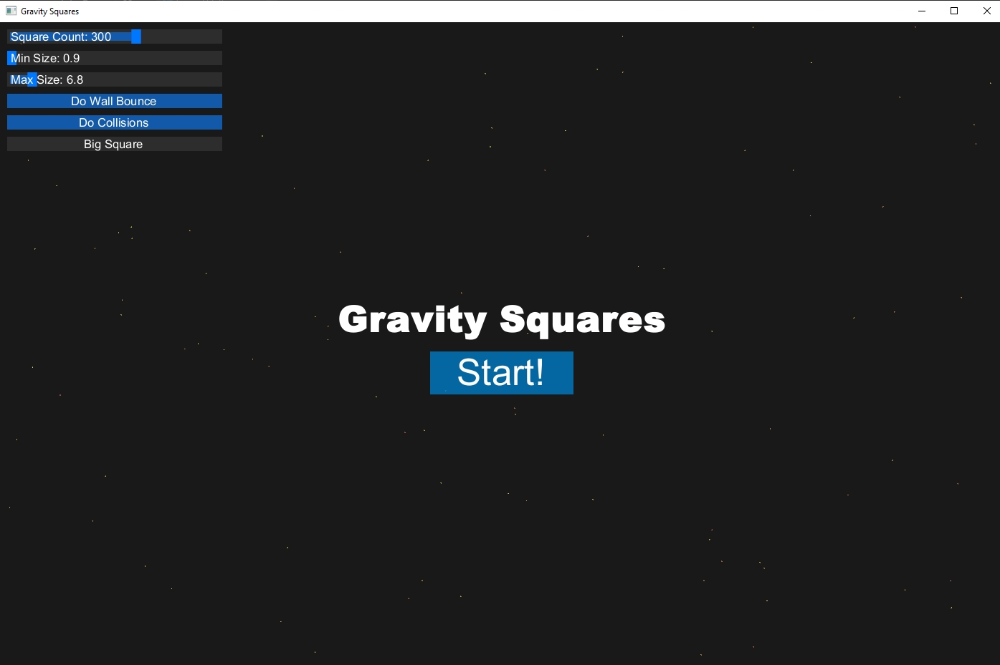

# GravitySquares
Gravity Squares is a simple applet gravity simulator for a bunch of little, random squares

This app is built using GlowUI and GlowLib

The app uses a true physics engine to calculate the gravity for each individual object on screen.
The simulation is fun to look and and mess around with. (Even try dragging the squares!)

As soon as you start the program, you are greeted with a title screen with flickering stars, a start button, and modifiable options for the simulation in the top left corner

